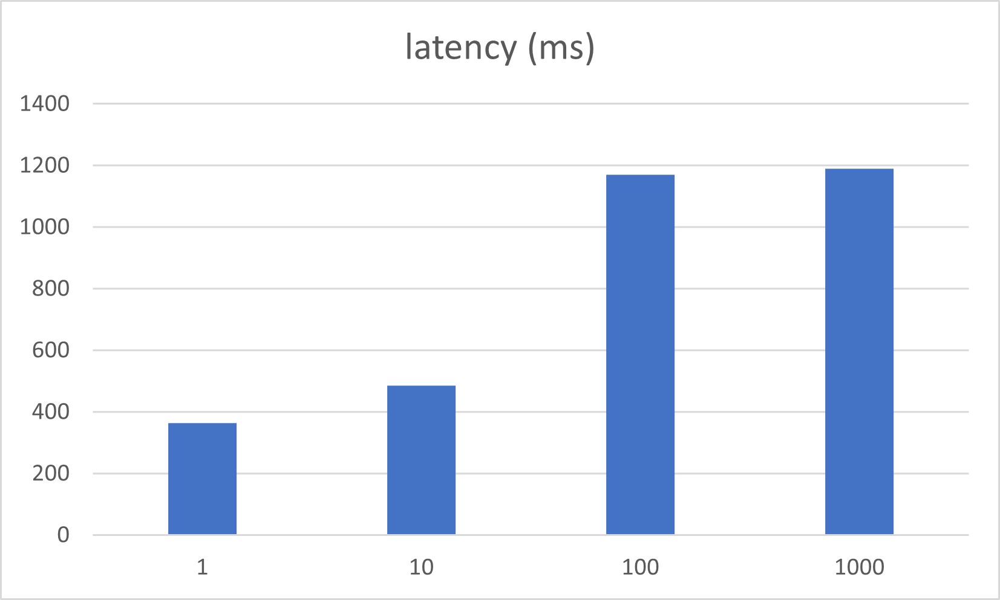

# Отчет по индексам

## Исходные данные

* Таблица `users` содержит 1_000_000 записей, сформированных с помощью библиотеки https://github.com/DiUS/java-faker
* В таблице есть индекс только по primary key
* Необходимо реализовать быстрый ответ на запрос

 ```sql
explain format = json
select *
from social_network.users
where first_name LIKE 'ab%'
  and users.last_name LIKE 'ab%';
```

## Результаты нагрузки до добавления индекса

* `Explain` в формате JSON выдает `cost_info: 94800` и `access_type: ALL`




## Результаты нагрузки после добавления индекса

* Добавлен индекс, который покрывает оба поля

```sql
create index first_name_last_name_idx on users (first_name, last_name);
```

* Теперь `explain` в формате JSON выдает `cost_info: 1108` и `access_type: range`, `key: first_name_last_name_idx`
* В результате добавления индекса удалось добиться значительного прогресса как в latency, так и в throughput


