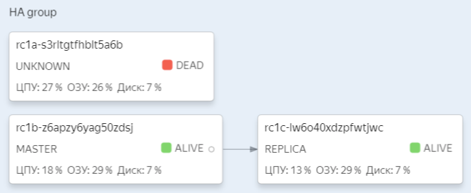

# Репликация

### Настраиваем асинхронную репликацию

* Развертывание проводилось Yandex.Cloud как managed MySQL
* Поднимался один master и один slave в разных зонах доступности
* И у master-а, и у slave-а есть публичный доступ

### Выбираем тяжелый запрос на чтение и переносим его на slave

* Выбрал запрос, который использовался для домашнего задания по индексам

```sql
select *
from social_network.users
where first_name LIKE 'ab%'
  and users.last_name LIKE 'ab%';
```

* Сконфигурировал в приложении второй `DataSource` для slave-а

### Делаем нагрузочный тест по запросам, перенесенным на slave

* Результаты нагрузки на master

```
  Thread Stats   Avg      Stdev     Max   +/- Stdev
    Latency    12.88ms   22.33ms 324.70ms   97.76%
    Req/Sec    485.20     81.50   717.00    80.27%

Requests/sec:    962.43
Transfer/sec:    2.92MB
```

* Результаты нагрузки на slave

```
  Thread Stats   Avg      Stdev     Max    +/- Stdev
    Latency    14.65ms   29.16ms 348.35ms   97.32%
    Req/Sec    472.04     93.02   696.00    75.67%

Requests/sec:    939.34
Transfer/sec:    2.85MB
```

* Среднее время ответа slave примерно на 10% хуже, возможно это связано с тем, что реплика в зоне доступа, расположенной
  географически дальше

### Настроить 1 master и 2 slave-а

* Добавил еще один slave (без публичного доступа) в третьей зоне доступности

### Включить row-based репликацию, GTID, настроить полу-синхронную репликацию

* Row-based репликация включена -- параметр `Binlog row image = FULL`
* GTID включен по умолчанию или можно сконфигурировать в `my.conf`

```properties
binlog_format=ROW
gtid_mode=ON
```

* Полу-синхронная репликация настроена по умолчанию в managed MySQL в Yandex.Cloud

### Создать нагрузку на запись

* Нагрузка создавалась немного доработанной утилитой, которая использовалась в прошлом ДЗ для создания 1_000_000 записей

### Убиваем master MySQL

* Остановил мастер в консоли
  

### Проверяем, есть ли потери транзакций

* Было произведено 2 теста записи (в 1 и 10 потоков) и остановки мастера

| Записано строк | Количество потоков | Потеряно строк |
|----------------|--------------------|----------------| 
| 2_000          | 1                  | 0              |
| 20_000         | 10                 | 0              |